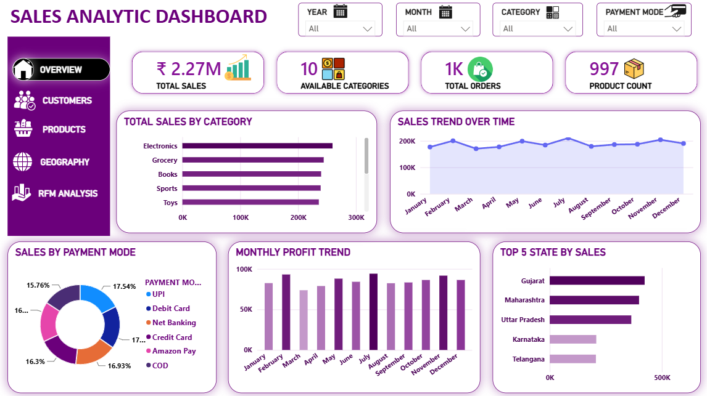
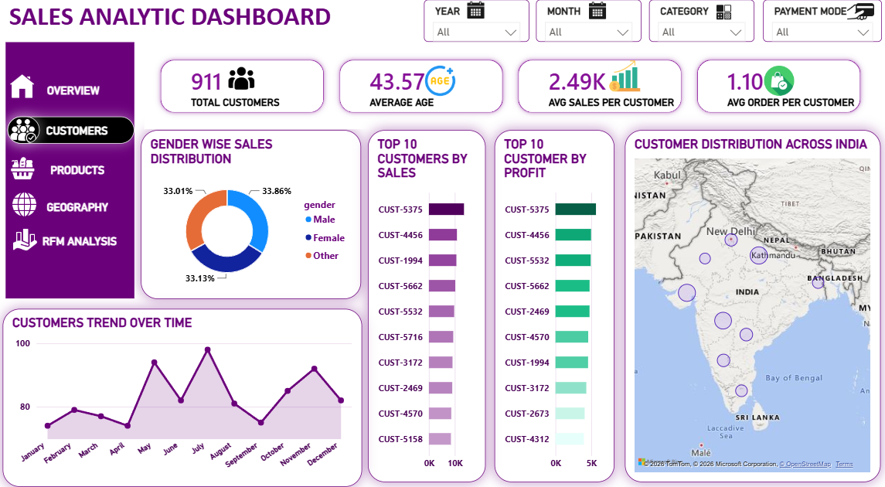

Sales Analytics - End to End Project

Built with MySQL | Power BI | Python

About

I am Yash Shukla, an aspiring data analyst from India. This is my first end to end data analytics project where I worked on everything myself - from creating the dataset to building the final dashboard. I built this project to learn how real world data analysis works and to grow my skills in SQL, Python and Power BI.

The dataset I used is a custom dataset I created myself based on Amazon India sales data. It covers 911 customers, 997 products and sales across 9 Indian states.

Dashboard Preview

What I Found in the Data

Gujarat is the top performing state contributing 18.6% of total revenue across all 9 states.

Big Spenders are only 29% of total customers but they are responsible for more than half of the total profit. This tells me that retaining this small group of customers is extremely important for the business.

Electronics is the highest selling category generating around 2.98 lakh in revenue.

I identified 212 risky customers using RFM analysis who have not purchased recently and need to be targeted with retention campaigns.

Monthly sales were consistent throughout the year with the highest peak coming in July.

Tools I Used

MySQL 8.0 was used for all data modelling, writing queries, joins, window functions and RFM scoring.

Python was used for data cleaning and preprocessing before loading into Power BI.

Power BI was used to build a 5 page interactive dashboard with slicers, maps and charts.

Project Structure

01_dataset contains the data dictionary explaining every column in the dataset.

02_sql contains 7 SQL scripts covering table setup, KPI analysis, customer analysis, product analysis, time analysis, geographic analysis and RFM analysis.

03_python contains the data cleaning script written in Python.

04_dashboard contains the Power BI pbix file.

05_screenshots contains screenshots of all 5 dashboard pages.

SQL Files Breakdown

01_table_setup.sql handles database setup and merged table creation.
02_kpi_analysis.sql covers total sales, profit, orders and cost KPIs.
03_customer_analysis.sql covers customer segments and top customers by state.
04_product_analysis.sql covers top and bottom products and category wise profit.
05_time_analysis.sql covers monthly trends and month on month growth using LAG.
06_geographic_analysis.sql covers state and city wise sales and discount analysis.
07_rfm_analysis.sql covers RFM scoring using NTILE and CASE WHEN logic.

Dashboard Pages

Page 1 Overview shows total sales, profit, category performance and payment mode breakdown.
Page 2 Customers shows gender split, top customers by sales and profit and India map.
Page 3 Products shows top and bottom performing products and profit margins.
Page 4 Geography shows state and city wise sales and profit with percentage breakdown.
Page 5 RFM Analysis shows customer segmentation into Champions, Loyal, Big Spenders, Regular and Risky customers.

What This Project Taught Me

This project made me realise that data analysis is not just about making charts. It is about asking the right questions and finding answers that actually matter to a business. The RFM analysis part was the most interesting for me because it showed me how you can understand customer behaviour just from transaction data. I learned a lot building this and I am excited to keep growing.

Connect with Me

GitHub - github.com/Yashshukla11111
LinkedIn - add your linkedin link here
